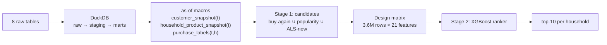

# Retail Recommender Platform

A leakage-safe, two-stage product recommender built on the dunnhumby *Complete Journey*
grocery dataset (2,500 households · 2.6M purchase lines · 2 years), from raw CSVs to a
sealed out-of-time evaluation.

**Headline result:** on a 30-day window the model had never seen, the ranker recommends
10 products per household and beats the strongest heuristic by **59%** — capturing
**15.8% of the next month's spend** in those ten slots.

---

## Sealed test — day 650 (never used for training or tuning)

All models score the **identical candidate pool**; only the scoring rule differs, which
isolates the contribution of stage two.

| Model | recall@10 | hit-rate@10 | NDCG@10 | revenue-weighted recall@10 | share of oracle ceiling |
|---|---|---|---|---|---|
| **XGBoost ranker** | **0.105** | **0.865** | **0.442** | **0.158** | **26%** |
| buy-again (recency + frequency) | 0.066 | 0.750 | 0.284 | 0.085 | 17% |
| popularity | 0.045 | 0.722 | 0.204 | 0.080 | 11% |
| ALS affinity | 0.029 | 0.405 | 0.071 | 0.015 | 7% |

Oracle ceiling = 0.396: households buy ~25 distinct products per month, so ten slots can
cover at most ~40% of purchases. Validation recall@10 was 0.104 versus 0.105 sealed —
the model generalizes without early-stopping flattery.

---

## Architecture



**Stage 1 — candidate generation** (recall-oriented). Three sources pool to ~544
candidates per household: full purchase history, the 50 most popular products, and 50
never-bought items from implicit-ALS embeddings. Pooled candidate recall **0.489**
(repeat purchases 1.000, discovery 0.038) — the ceiling stage two inherits.

**Stage 2 — ranking** (precision-oriented). XGBoost estimates
P(bought within 30 days | customer state, item state, interaction state) for each
candidate; the top 10 by score are recommended.

**Leakage control.** Every feature is measurable at the snapshot date by construction:
features come from as-of-parameterized SQL macros, ALS is refit per snapshot, item
popularity is computed on a trailing 365-day window, and product reorder cycles are
estimated only from data preceding the earliest training plane. Training uses days
450/510/570; validation 600; test 650, opened once.

---

## Key findings

**Two models were tested and rejected with evidence.** Department-localized popularity
*underperformed* global popularity — diversifying away from universal staples costs more
base-rate hits than category affinity recovers. Item-kNN on basket co-visitation lost to
popularity even on the discovery slice where buy-again scores zero by construction; raw
lift proved to be a niche-noise amplifier (a pair of rare items co-occurring 5 times
scores lift ≈ 13,500 against bananas-and-milk at ≈ 2).

**ALS failed as a model and succeeded as a feature.** Solo recall of 0.029, but its
affinity score moves the label rate 0.9% → 8.6% across deciles and it is the fifth most
important feature in the ranker. Learned embeddings connect items that never co-occur —
which co-visitation counting structurally cannot.

**Error analysis reversed a conclusion.** Raw recall by household activity suggested
heavy shoppers were the weak segment (0.090 vs 0.112 for light households). Normalizing
by per-segment oracle ceilings (0.222 / 0.436 / 0.616) inverts it: the model achieves
**40.8%** of ceiling for heavy households versus **18.2%** for light ones. Heavy
shoppers have deep histories and are predicted well; thin-history households are the
true weakness. Optimizing on raw recall would have targeted exactly the wrong segment.

**Customer-level features are inert in a pointwise ranker.** Every household-level
feature scored ≈0.005 importance, because ranking happens *within* a household and those
features are constant across its candidates — they can only act through interactions.
The indicated next step is within-household feature normalization or grouped LambdaMART.

## Deployment

Two container images, both built and verified in CI on every push:

- **`retail-score`** — batch scoring CLI (`--as-of <day>`), writes top-K
  recommendations to parquet. Runs as a Kubernetes **CronJob** (nightly,
  `concurrencyPolicy: Forbid`, retries on failure).
- **`retail-api`** — FastAPI service exposing `/recommendations/{household}`
  and `/health`. Runs as a **Deployment** (2 replicas) behind a **Service**,
  with liveness and readiness probes on `/health` so traffic only reaches
  pods that have loaded their data.

Code and dependencies live in the image; the database, model registry, and
outputs are mounted at runtime. Logs go to stdout for cluster-native
collection. Verified end-to-end on a local `kind` cluster: pod deletion
self-heals in ~3s, and a manually triggered CronJob run scored 2,499
households inside the cluster.

## Repository tour

```
configs/          base.yaml (snapshot calendar, budgets), schema.yaml (data contract)
sql/              00_load → 10_staging → 30_marts (as-of macros live here)
src/retail_ds/    data/validate.py · features/design_matrix.py · evaluate/metrics.py
notebooks/        00_eda → 10_baselines → 20_cf → 30_ranker → 90_evaluation
scripts/          init_db.py (builds db/retail.duckdb from the sql/ stages)
reports/          leaderboard.csv, sealed_test_day650.csv
models/registry/  ranker.ubj + model_meta.json (training provenance)
```

## Quickstart

```bash
pip install -e ".[dev]"                     # environment + package
# place the dunnhumby Complete Journey CSVs in data/raw/
python -m retail_ds.data.validate           # schema + row-count contract
python scripts/init_db.py                   # build the DuckDB database
```

Then run the notebooks in numeric order, or load `models/registry/ranker.ubj` and score
directly with `retail_ds.features.design_matrix.build_plane`.

## Data

[dunnhumby — The Complete Journey](https://www.dunnhumby.com/source-files/): 8 relational
tables covering household transactions, product hierarchy, partial demographics (801 of
~2,500 households — informative missingness), marketing campaign exposure, coupon
redemptions, and weekly in-store display/mailer state.

## Limitations

Recommendations optimize correlational relevance, not incremental effect: without
impression logs, negatives are *manufactured* from unpurchased pool candidates rather
than observed non-clicks, and the model cannot distinguish purchases it caused from
purchases that would have happened anyway. Uplift modeling on the campaign tables is the
designated next phase. The panel is curated frequent shoppers, so conclusions generalize
to a loyalty file rather than to all customers.
